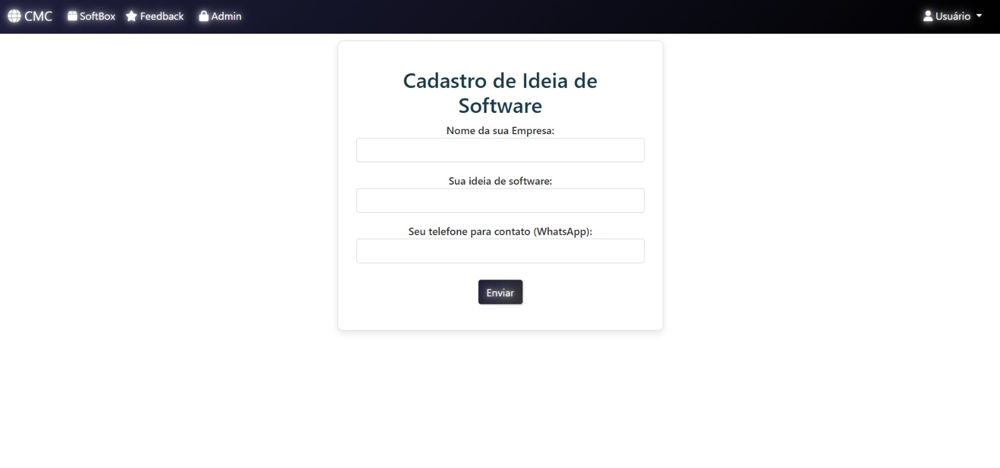
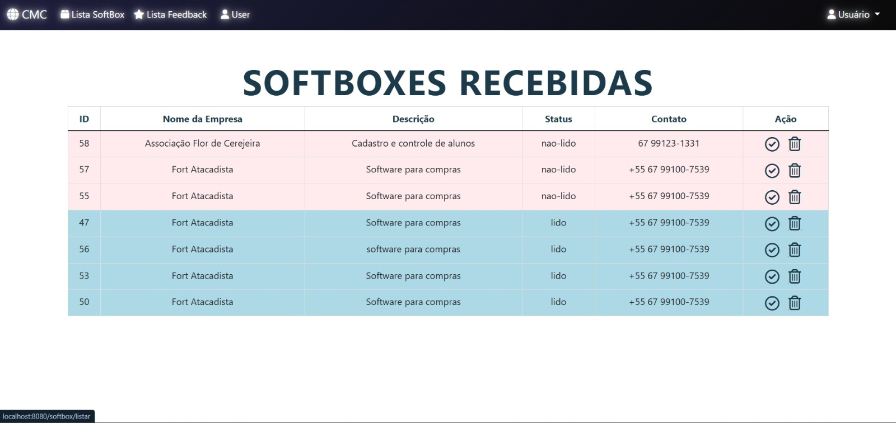
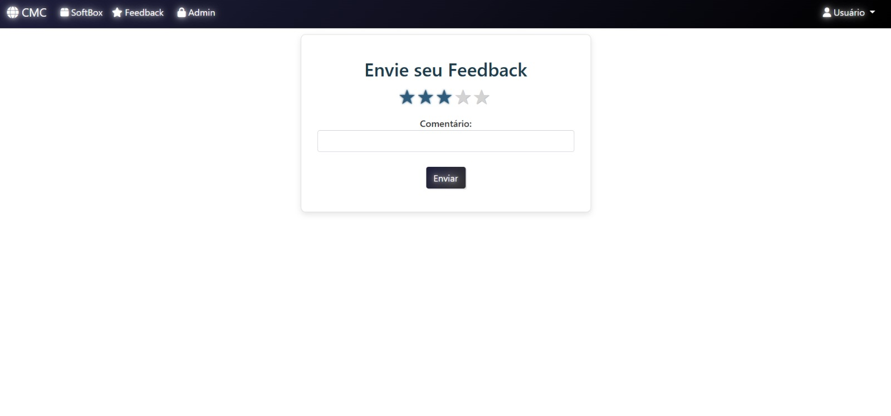
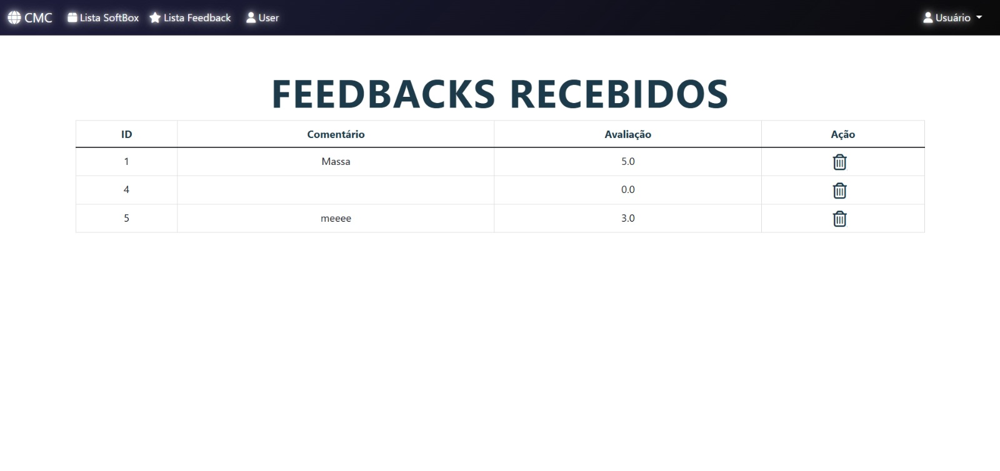
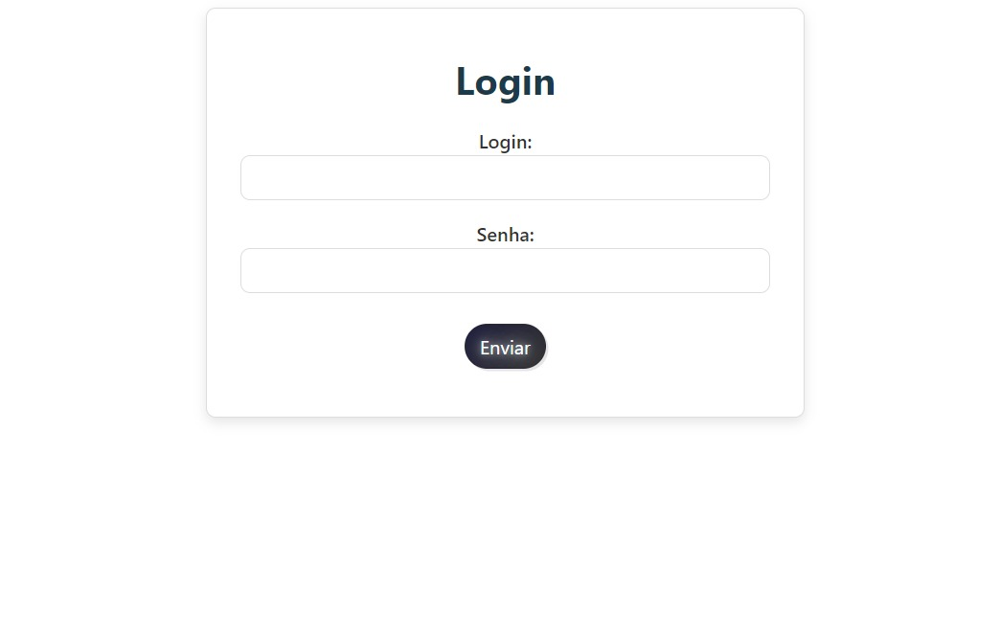
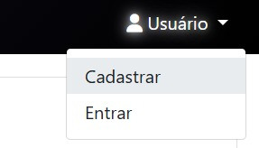
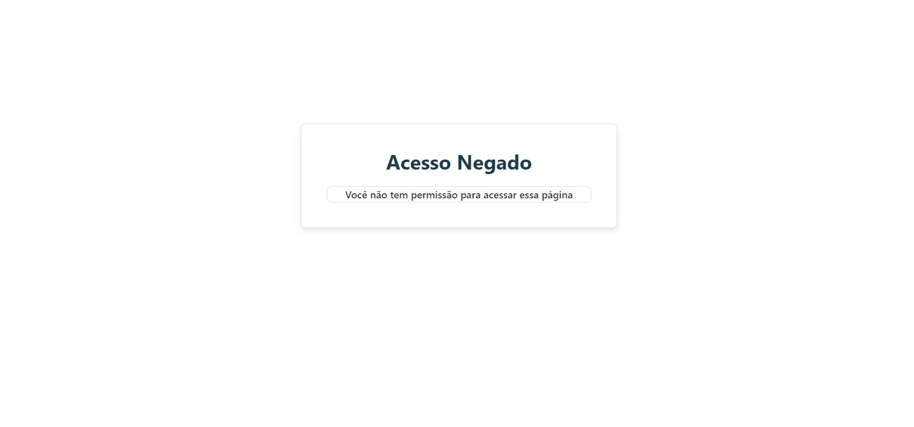

<h1>Imagens do resultado parcial da aplicação</h1>

Cadastro de Software (USER)

Listagem de Software (ADMIN)

Envio de Feedback (USER)

Listagem de Feedback (ADMIN)

Tela de Login

Dropdown Button

Tela de Acesso Negado

